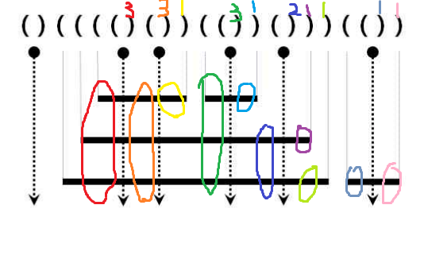

# 10799-쇠막대기

## 오답노트

### 내 접근 방법
1. '('를 push, ')'를 pop이라고 생각하고 문제에 접근했다.

2. 괄호가 닫힐때(pop을 할 때) 개수가 더해질 거라고 생각했다.

3. push할 때마다 count를 하나씩 더해주고, pop을 할 때 count를 빼준 뒤 count만큼 sum에 더하면 될 거라고 생각했다.

=> 이때 '예제 입력 1'이 제대로 출력 돼서 방법이 맞다고 생각했지만, '예제 입력 2'의 답이 '24'가 아닌 '26'으로 출력되어 틀렸다.
```
// 예제 입력 1
()(((()())(())()))(())

// 예제 출력 1
17

// 내 코드 출력값
17


// 예제 입력 2
(((()(()()))(())()))(()())

// 예제 출력 2
24

// 내 코드 출력값
26
```

<br>

<br>


## 풀이
sum: 전체 쇠막대기 조각 개수를 저장할 변수<br>
count: 열려있는 괄호의 개수
1. 문제에서 괄호쌍 '()'이 한 번에 열렸다 닫히는 부분을 레이저라고 한다. 이 레이저 부분은 내가 생각했던 대로 count(열린 괄호의 개수)만큼 sum에 더해주면 된다.

```
sum += --count;
```
2. 내가 놓친 부분은 레이저가 아닌 경우에는 count만큼 더해주는 것이 아닌 1만큼만 더해주면 된다는 점이다.

<br>

레이저를 쏴서 count만큼 더해주는 것은 쇠막대기의 잘려진 왼쪽 부분의 수를 더하는 것이다.<br>

레이저가 아닐 때 괄호를 닫는 것은 쇠막대기의 잘려지고 남은 오른쪽 부분을 더하는 것이기 때문에 하나씩만 더해주면 된다.<br>


